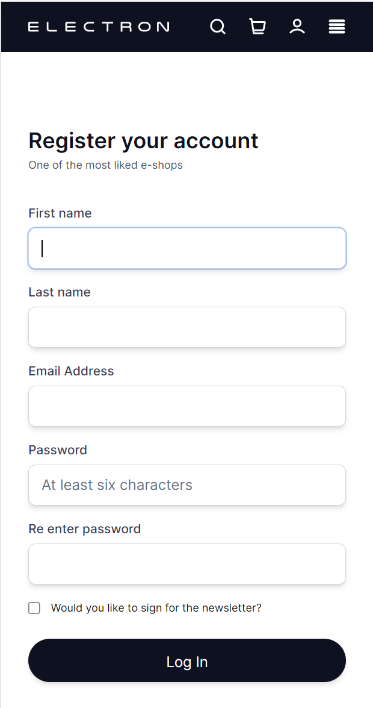
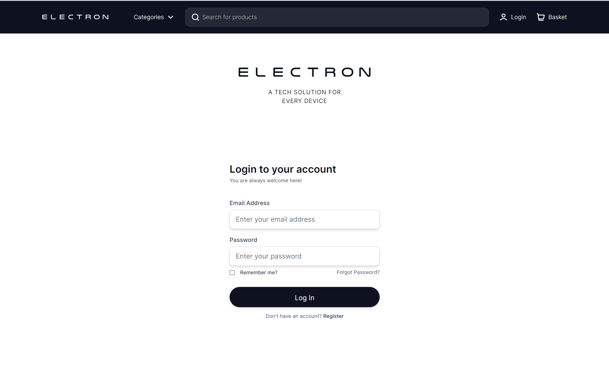

### Electron Ecommerce

Author: Dominik Tworek

Tech Stack: Typescript, React, Tailwindcss, Java, Spring Boot, MySql

Description: Fake e-commerce full-stack application created for educational purposes.

The authentication system has been fully implemented on the frontend and backend side.
More coming soon...

Authentication Key Features:

    🔐 Secure JWT/Refresh Token Implementation
    📧 Email Activation & Password Reset
    📱 Multi-Device Login
    🔒 Secure Logout from every device
    ✅Responsive Design
    🌐 Optimized Performance

Design - created in Figma by a designer from Fiverr:

